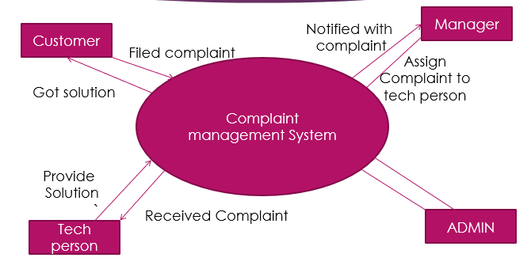

<h1 align='center'>Complaint Management System</h1>
<h4 align='center'>A Project that used to submit customer’s complaints to the authorised company and make an interface between them.</h4>
 

 

A Complaint Management System is a software application which is designed to take online complaints from customers and provide their solutions by some experts. It is the process of how organizations handle, manage, respond to and report customer complaints. 

<h3>How this Project works:</h3>

  
<h3>Working:</h3>

 <ol>
   <li>In a customer, you just have to submit your complain. </li>
   <li>Then, your compalin will automatically send to Manager section. </li>
   <li>Then Manager assigns that complain to respective Techperson. </li>
   <li>And Techperson will solve your complain.</li>
   <li> And the very moment, when your complain has been resolved, You will be inform through a text message on you registered Mobile no.</li>
 </ol>
  

<h3>Technologies used:</h3>
<ul>
  <li>Python</li>
  <li>MySQL</li>
  <li>Xampp (Not being a website project, but to implement MYSQL in a better and efficient manner, I have used XAMPP server software, as it gives me better interface to manage the database at the backend.)</li>
  
 </ul>

<h3>Hardware Requirements:</h3>
<ul>
  <li>Processor : Pentium IV or above</li>
  <li>Memory : 1 GB or above recommended for better use</li>
  <li>Disk Space : Minimum of 100MB of free space in Hard Disk.</li>
  <li>Internet connection to access the SMS API portal.</li>
</ul>
<h3>Software Requirements:</h3>
<ul>
  <li>Any Operating system with Python Compatibility.</li>
  <li>Python version 3.0 or above.</li>
  <li>MYSQL database.</li>
  

Thanks for reading 😊

