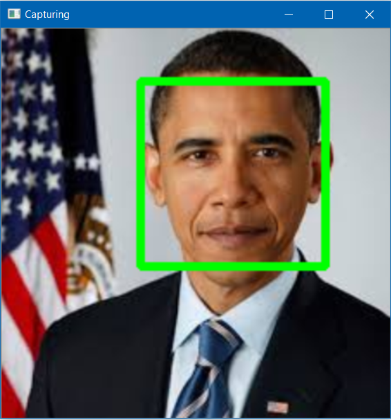

<h1 align="center">Face Detection of an image</h1>
This project detects a face from a photo or any image.

<h3>👉When we provide here input as this image:</h3>

  
  

<h3>👉It gives this as the output:</h3>

  
  

