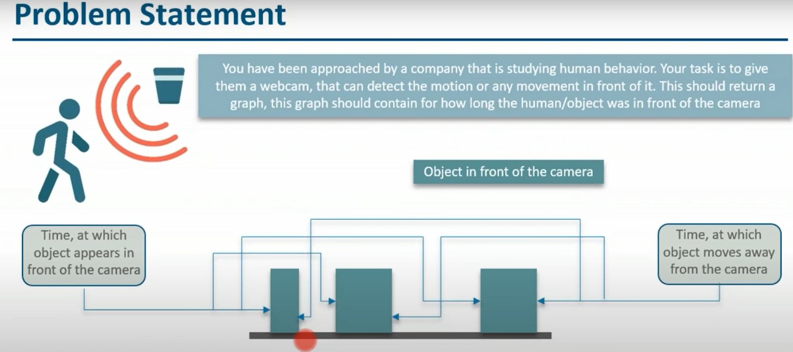
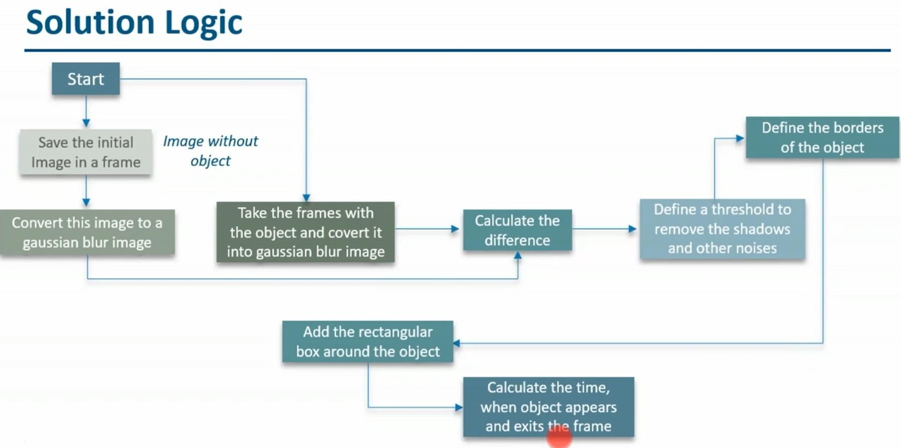
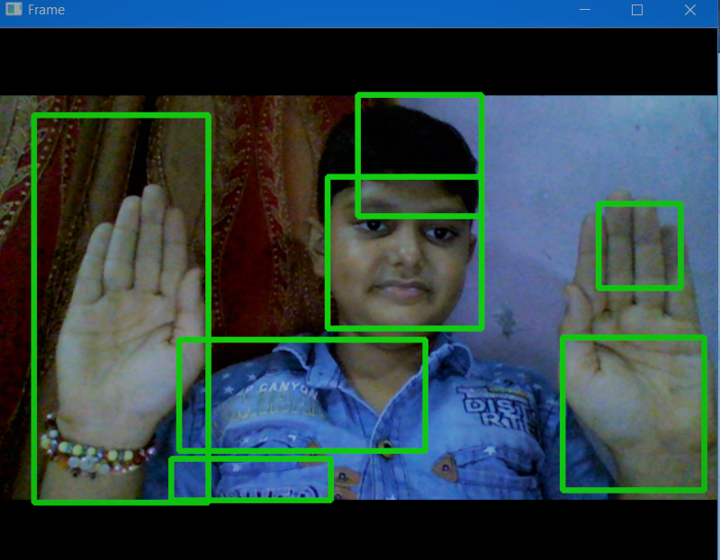
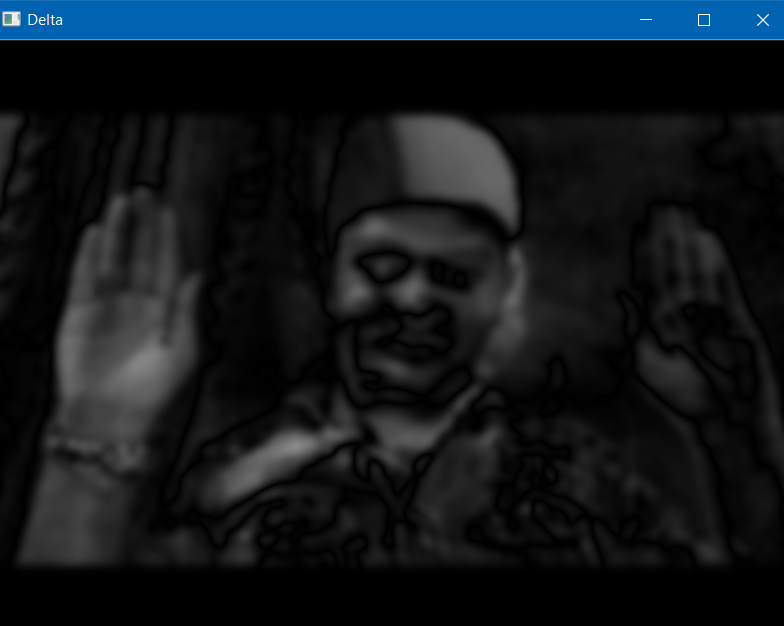
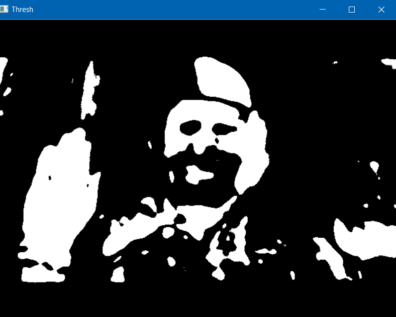
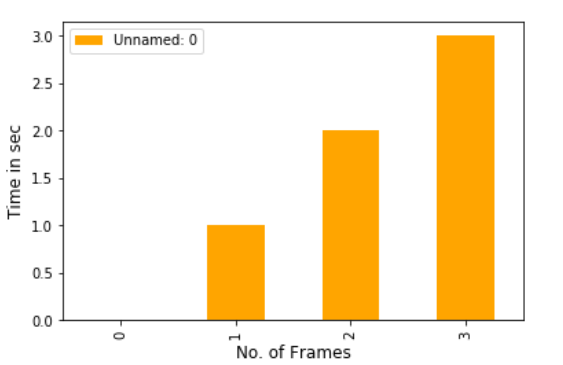

<h1 align="center">Motion Detector</h1>
<h4 align="center">This projects detects the change in the motion through the camera.</h4>

<h2>👉We have a Problem statement of a company:</h2>
 

  
  

<h2>👉And I come up with a Solution logic given below:<h1>
 

  
  

   
   
 <h2>👉This is how it works:</h2>
 

  
  
  
  
  

   <h2>👉And This is how Output will come:<h1>
 

  
  

  
 
